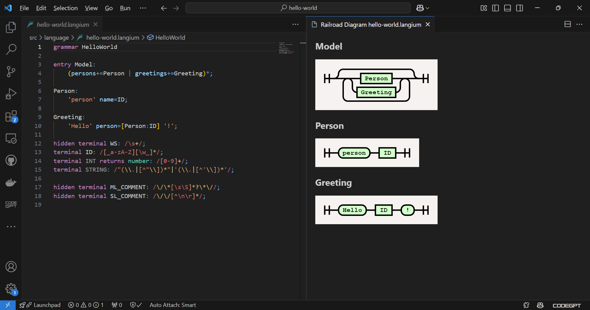
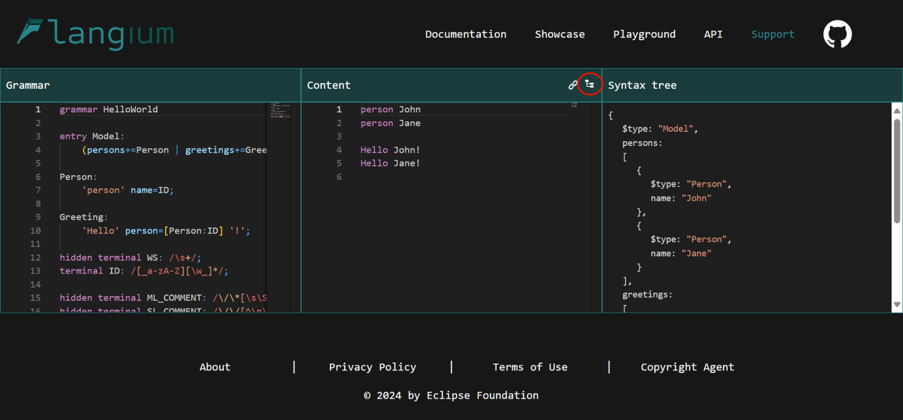
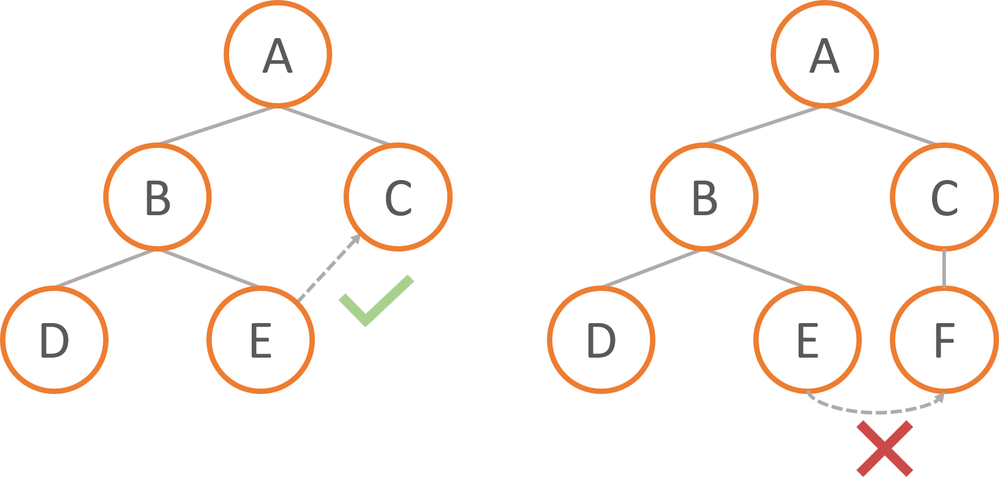

# Labs on Domain-Specific Languages (DSL)


These lab sessions are to be realized in groups of two.

## Overall objectives of the lab

During these lab sessions, you will create your own version of RoboML, a language to define the behavior of a small robot. Building the DSL will include modeling the domain (*i.e.*, the concepts and their relationships), and implements the associated tooling: *e.g.*, the text editor and its services, an interpreter (through a web-based simulator) and a compiler (to Arduino code that will run on the robot itself).

Below, you can find an example of a program that we expect to write in your language.

```
let void entry () {
    setSpeed(150 in mm) // distance per second (here 150mm/s)
    var number count = 0
    loop count < 5
    {	
        count = count + 1
        square()
    }
}

let void square(){
    Forward 30 in cm
    Clock 90
    Forward 300 in mm
    Clock 90
    Forward 30 in cm
    Clock 90
    Forward 300 in mm
    Clock 90
}
```

The above program, when executed, should set the speed of the robot and then perform 5 times (loop) a square pattern movement (square function).

The robot used for this lab has four wheels with individual motors, and an ultrasound sensor which can be used to measure distance to an object in front. We expect your language to mostly follow the imperative programming paradigm, with basic arithmetic and commands for the robot.

## Evaluation

These labs are split into three parts corresponding to the three main aspects of DSLs implementation: abstract syntax, concrete syntax, and semantics.

The lab sessions for this course will consist in the realization of these aspects. After each major step, you will need to showcase your work to your lab teacher through a small demonstration, which will be used to grade you. You can only move on to the next step once the teacher has validated the current part.

To encourage you to finish completely at least one of the two possible semantics, yet exploring both compilation and interpretation, you will have to choose a major and a minor semantics.
The major semantics will be used to evaluate your project.
The minor one is not mandatory but can give you bonus points.
The evaluation grid is the following:
- Abstract syntax: 5
- Concrete Syntax: 5
- Semantics: 10

## Part 1 - Domain modeling: definition of the language's metamodel with Ecore

The first step in defining a language is to model the concepts and their relationships in the domain targeted by your language. 
This results in the creation of the language's metamodel, defining its abstract syntax.
For this part, you can pick any tool you want: the Ecore framework, an online UML editor, or even simply a pen and a piece of paper!

If you chose Ecore, there are some instructions below to help with the technical aspect.

There is a short list of mandatory concepts that we want:
- Movement (front, back, sides)
- Rotation
- Speed
- Sensors (time, distance to obstacle in front of the robot)
- Units (*e.g.*, cm, mm)
- Basic arithmetic and boolean expressions
- Control structure (loop, conditions)
- Functions and variables

**N.B.:** For units, you can either implement it as "cast function" or as a concrete type in the language.
> For units, you can either implement it as "cast function" or as a concrete type in the language.  
As a cast -> `var number length = 10 in cm`.  
As a type -> `var cm length = 10`.

### Ecore modeling

Within your Eclipse RCP that includes EMF, Xtext, and Xtend (e.g., [Eclipse DSL](https://www.eclipse.org/downloads/packages/release/2024-12/r/eclipse-ide-java-and-dsl-developers) with the added [Ecore tools](https://projects.eclipse.org/projects/modeling.emft.ecoretools) which you can install with _Help_ -> _Eclipse Marketplace..._ -> search for `ecoretools`), create an _Ecore Modeling Project_. Then you can start modeling your domain as an object-oriented metamodel, which should represent the different concepts of your language and how they are related.

You may validate your metamodel by right-clicking on your ecore model and then clicking on _Validate_.

When this is done, you can generate the Java-based implementation of your domain model by opening the associated `genmodel` file, right-clicking on the root element, and _Generate all_. This is not mandatory to continue the lab.

You may assess the expressivity of your metamodel (*i.e.*, check if it captures your domain well, in your case meaning it supports the modeling of the proposed example) by opening the Ecore metamodel, right-click on the concept of the root element of your expected model, and choose _Create dynamic instance_. Then you can create a model in a tree-based editor, and ensure your metamodel supports the expected model structure. 

## Part 2 - Textual modeling: definition of the Langium grammar and editor for your language

After determining the domain, it is time to move on to the actual text editor for your language. In this lab, we will build this editor using the TypeScript-based [Langium](https://langium.org/) workbench to build a Visual Studio Code extension supporting the edition of your language.

If not done already, you will need to install a [node environment](https://nodejs.org/en/download) as well as [Visual Studio Code](https://code.visualstudio.com/docs/setup/setup-overview), and then run the command `npm i -g yo@7.1.1 generator-langium@3.3.0` to install the Langium project generator. Then, run `yo langium` to create the project. This will offer to create a few different things; you **have to** say yes to all of them, pick a language name, extension name, and a file extension (*e.g.* .rob).
You can also install the Langium extension from the VSCode marketplace, to have syntax highlighting and validation in your grammar.

> [!IMPORTANT]
> We use a particular version of yo and generator-langium in these labs due to the rapid change in the version of Langium.
> **Make sure that you use these versions**.

Depending on what modeling tool you picked in Part 1, the next step can change a little bit. If you picked another method than Ecore, skip the following section.

> [!NOTE]
> There is flexibility in the concrete syntax of the language, but make it concise and usable for non-experts in programming. Ask your teacher during labs if you plan to change the syntax.

### Ecore modeling

If you decided to model your domain using Ecore and Eclipse in the previous part, you may be aware that it is possible to generate an Xtext project from an Ecore project (by creating a new _Xtext Project From Existing Ecore Models_). Fortunately, it is possible to convert an Xtext grammar into a Langium grammar thanks to [this project](https://github.com/TypeFox/xtext2langium). You can thus write your grammar using Xtext rather than Langium if you so wish.

To convert a grammar, go to the Eclipse menu _Help_ -> _Install new software_ -> in the site field, paste the URL `https://typefox.github.io/xtext2langium/download/updates/v0.4.0/` and install the package. Afterward, go into your Xtext project's `META-INF/MANIFEST.MF`, switch to the _Dependencies_ tab, and add Xtext2langium as a dependency. Don't forget to save your manifest file. Then you can go to the MWE2 file (named something like `GenerateMyDsl.mwe2`) in your project, and replace the `fragment` field with:

```
fragment = io.typefox.xtext2langium.Xtext2LangiumFragment {
        outputPath = './langium'
    }
```

Right-click the MWE2 file and run it. You should see a `langium` folder appear in your project, with corresponding `.langium` grammar files which you can put into your `src/language/` folder of the Langium project. Make sure the grammars names match up between your projects, otherwise you will have to manually refactor the conflicts.

### Other types of modeling

Since you have previously modeled your domain, we need to translate that modeling effort into a metamodel that can be understood by Langium. This can be done by inserting TypeScript-like interfaces in the grammar, the full specification of which can be seen [here](https://langium.org/docs/reference/semantic-model/#declared-types). As an example, this could be the model used for a Finished State Machine language:

```ts
interface StateMachine {
    name: string
    states: State[]
    transitions: Transition[]
    initialState: State
}

interface State {
    name: string
    output: string
}

interface Transition {
    name: string
    input: string
    start: @State
    target: @State
}
```

You can then write the textual grammar rules that will return your specified types.

### VSCode extension with Langium

Once you have a valid [Langium grammar](https://langium.org/docs/grammar-language/), you can launch the commands `npm run langium:generate` and `npm run build` to build the project.

You can test your editor as you make changes either by launching the command `code --extensionDevelopmentPath=$PWD`, or by starting a debug session in VSCode, both of which will open a VSCode instance with your extension loaded in. You can create examples and test files for your language in this instance. A goal for this part can be to have your language parse the examples given in this document, such as the following:

```
let void entry () {
    setSpeed(200 mm) // distance per second (here 200mm/s)
    var number time = getTimestamp()
    loop time < 60000
    {
        var number dist = getDistance() in cm
        Forward dist - 25 in cm
        Clock 90
        time = getTimestamp()
    }
}
```

> [!NOTE]
> If you have made changes to the syntax, the equivalent AST with your syntax is your test.

### How to verify my grammar?

When the grammar grows, it may be difficult to verify if your grammar is valid.
Even by testing your language, you cannot ensure your AST is built as you want.
To help language designers with this task, Langium provides two different tools.

The first one is directly accessible from the Langium VSCode extension, by typing `>railroad` in the quick access (CTRL + SHIFT + P) and clicking on "Langium: Show Railroad Syntax Diagram". 
This will open a new panel and display you your grammar in a graphical way. 
It allows you to verify your grammar at a higher level.



The second one is accessible from the Langium website, on the [`Playground` page](https://langium.org/playground/).
Here you can paste your grammar (without forgetting to also past your types and terminals, and removing your imports) and a program conforms to the grammar.
By clicking on the "Tree" icon, you can open a new panel displaying the abstract syntax tree of your program, in JSON.
However be aware, the playground has sometimes some refresh issues so the program text editor may be not synchronized anymore with the grammar one.




## Part 3 - Executable modeling

In the previous steps, you have first identified the core concepts of your language and implemented a textual syntax to define instances of those concepts. 
By now, your programs should be parsable, which means Langium will be able to give you an [Abstract Syntax Tree](https://en.wikipedia.org/wiki/Abstract_syntax_tree) (AST) representing your programs. 
The next step is to try and execute those model instances: this can be done either through interpretation or compilation. You will need to implement these in a `compiler.ts` and `interpreter.ts` file (take a look at the `generator.ts` in the cli folder), which you should put in a new `src/semantics/` folder.

To execute the program, you will use the [visitor design pattern](https://en.wikipedia.org/wiki/Visitor_pattern) to implement a compiler targeting the Arduino language (allowing the execution on a real robot) and an interpreter directly executing the program.
The visitor pattern allows you to split the language definition into two parts: the syntax (abstract syntax defined through the metamodel and concrete syntax defined by the grammar), and the semantics (interpreter and compiler), easing the extension/evolution of the language semantics.
Each method implemented in a visitor represents the semantics of a concept, often relying on the semantics of its child in the AST.

Langium does not provide a visitor pattern by default.
To avoid creating the pattern manually, you can use an external library: [langium-visitor](https://www.npmjs.com/package/langium-visitor).
To use it, you will need to install it in your project with `npm i -D langium-visitor`.
You can then add a new script command in your `package.json` file to generate the visitor: `"langium:visitor": "langium-visitor"`.
The library will use the JSON grammar compiled by Langium from your `.langium` files to automatically generate the visitor interfaces.
More information about how to plug the visitor into your Langium project can be found on the [Github repository](https://github.com/theogiraudet/langium-visitor).

### Interpretation: 

In this lab, your interpreter will run on a web-based simulator for the robot written in JavaScript.
You will find in the interpreter folder of this repository, the code of the simulator provided for this part of the lab.
The Typescript files in the `src/web/simulator` folder represent the elements of the simulation used in your interpreter.
Especially, you will find the *Robot* class that will be manipulated by your interpreter.
In addition, you will find the scene classes representing the environment in which the robot evolves.  
The scene **REQUIRES** you to add timestamp objects recording the steps of the simulation to replay it on the web page.  
The TypeScript files in the `src/web/lib` folder are used to display the simulation on the web page and should only be used on the client side.
This TypeScript code expects to receive the final state of the scene simulated.
The `static` folder needs to be merged with the `static` folder of Langium and the `index.html` files must replace the existing one.
Finally, we use P5 to render the simulation in the browser, so you have to install it:

```bash
npm i p5@1.11.3
npm i -D @types/p5@1.7.6
```

To understand how to create the communication between the LSP server and the client, we propose you to first create a 'parseAndValidate' LSP action.
The general idea of the 'parseAndValidate' action can be found [here](https://web.archive.org/web/20230323045804/https://langium.org/tutorials/customizing_cli/), while the code required to define new LSP action usable in the web is detailed [here](https://web.archive.org/web/20230323041439/https://langium.org/tutorials/generation_in_the_web/).
However, the documentation for the web part is currently outdated for the latest version of Langium.
Instead of it, you can add this code in the `src/setupClassic.ts` file:

```ts
function getDocumentUri(wrapper: MonacoEditorLanguageClientWrapper): string {
    return wrapper.getModel()!.uri.toString();
}

// At the end of `executeClassic`
const client = wrapper.getLanguageClient();
if (!client) {
    throw new Error('Unable to obtain language client!');
}

setup(client, getDocumentUri(wrapper)); // setup function of the setup.ts file
```

You will find an example of communication between the client and the server from the client's perspective in the `setup.ts` file (lines 63 and 66).

On the server side, we need to modify the function `src/language/main-browser.ts` by adding this code at the end of the file:

```ts
function getModelFromUri(uri: string): <YourRootConceptFromVisitor> | undefined {
    const document = shared.workspace.LangiumDocuments.getDocument(URI.parse(uri));
    if(document && document.diagnostics === undefined || document?.diagnostics?.filter((i) => i.severity === 1).length === 0) {
        return document.parseResult.value as <YourRootConceptFromVisitor>;
    }
    return undefined;
}

connection.onNotification("custom/hello", (uri: string) => connection.sendNotification("custom/hello", "World"));
```

Here, we are listening a notification with the method `custom/hello`. When received, we are sending "World" to the client on the same method.
The client will display `Hello World!` in the console.
For your own code, you can replace the `"World"` by a call to your visitor.
The method `getModelFromUri`, enables, from a document URI, to get your root concept or `undefined` if the program is not valid.
Even if it is not used in this example, you can use it for your own code.

Finally, you can execute `npm run serve` to run your server/client architecture, and go to the printed URL to test your application.

### Compilation:

Since the objective of this lab is to be able to program a small four-wheeled robot using your language, you will need to be able to compile your code to something the robot can understand - in this case, the robot uses an Arduino card, which can be programmed using a [subset of C](https://www.arduino.cc/reference/en/). You will need to write a compiler that generates Arduino code based on the defined model.

To test your compiler, you will need the [Arduino IDE](https://www.arduino.cc/en/software). At first, you will not need the robot and just verify that the generated code is valid (Verify action in Arduino IDE).
When your generator generates valid Arduino programs, ask your teacher the robot to verify the correct (or not) behavior.

In the same idea as an interpreter, a compiler can also be implemented using a visitor pattern - but instead of directly simulating the behavior, you will generate the Arduino code representing this behavior.


As previously, you can put your visitor in the semantics folder. You can then use your compiler by adding a new command to the Command Line Interface provided by Langium, which will be the entry point from which you call the rest of your functions. Registering new commands can be done in `src/cli/main.ts`; once that is done, you should be able to call `./bin/cli.js compile <source>` (or `node ./bin/cli.js compile <source>`) in your terminal and have it generate Arduino code corresponding to the source program given as argument.

To understand how to call the semantics from the command line, we propose you to first create a 'parseAndValidate' action.
The description of the 'parseAndValidate' action can be found [here](https://langium.org/docs/learn/minilogo/customizing_cli/) ([archive](https://web.archive.org/web/20240916195444/https://langium.org/docs/learn/minilogo/customizing_cli/)).
After that, you will be able to call your visitor in a 'generate' action.

You will find in the `Compiler` folder an example of code to control the robot.
The global structure of this program will not require many changes.
If you want details on the possible actions, go look at the definition of the `demoAction` function used in the example, it uses most of the possible movements.
> You can find it in the MotorWheel lib, in the `Omni4WD.cpp` file

> [!WARNING]
> This robot requires non-classical libraries, you will have to add them.
> Copy the folders in the `compiler/Arduino Example/lib/` folder in the `libraries` folder of your Arduino IDE.

## Known issues

### No run configuration when trying to generate the Langium grammar from the Xtext one

**Have you installed the Eclipse plugin?**  
**Have you added the plugin to your Xtext project?**  
**Have you modified the `.mwe2` file?**  

If yes to all the questions, so you have to uninstall the MWE2 SDK and reinstall it.
For that:
- Go to Help → About Eclipse IDE
- Click on "Installation Details"
- Search for "MWE2 Language SDK" and uninstall it
- Confirm the different steps until Eclipse is restarted
- Go to Help → Install New Software…
- On "Work with", choose `2024-12 - https://download.eclipse.org/releases/2024-12`
- Search for MWE SDK and install it
- Confirm the different steps until Eclipse is restarted
Then, it should work.

### Some grammar rules are not generated in my Xtext grammar

At the creation of the Xtext project, when choosing your metamodel, be aware to correctly select your root concept in the drop-down list.

### The comments of the generated Langium grammar don't work

The Xtext to Langium plugin seems to badly generate the comment rules.
To fix that, remove the ones generated by the plugin in your terminal Langium file (`SL_COMMENT` and `ML_COMMENT`) and replace them with the following:

```
hidden terminal ML_COMMENT: /\/\*[\s\S]*?\*\//;
hidden terminal SL_COMMENT: /\/\/[^\n\r]*/;
```

### In Langium, my cross-references don't work even if the grammar looks correct

This may be linked to how Langium resolves the cross-references (the linking step).
By default, a named element (instance of a concept with an attribute `name`) is visible to all the elements that are (transitive) children of its container.
If there's an element in the middle of A and the elements you want A to be accessible, so merge the concept of A and its container.



### The `langium-visitor` visitor is not found

This error occurs only on Windows computers.
To resolve the problem, install `langium-visitor` in global:

```bash
npm i -g langium-visitor
```
